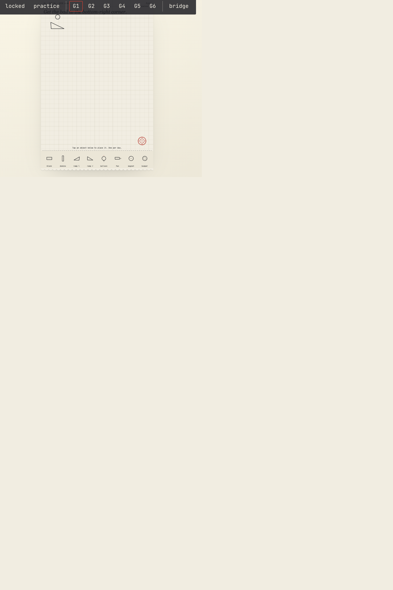
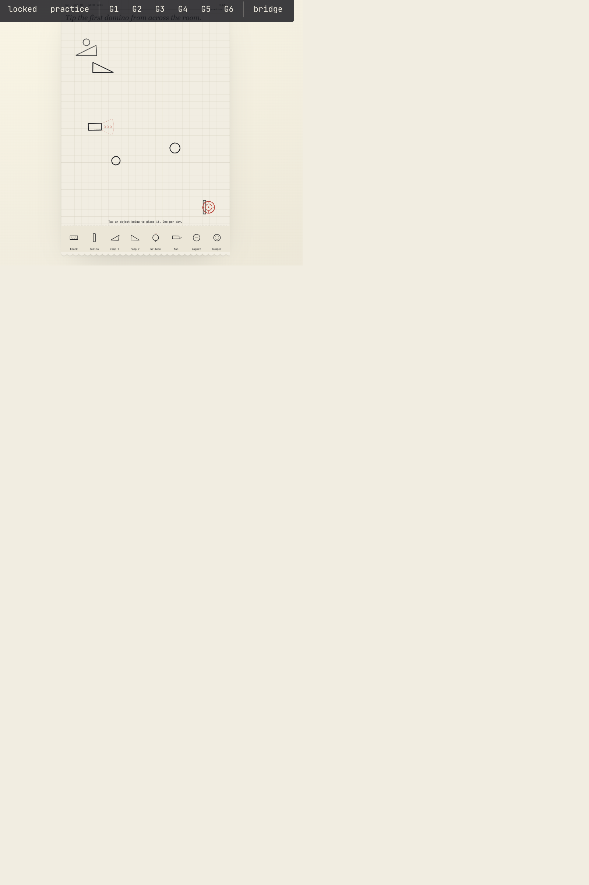
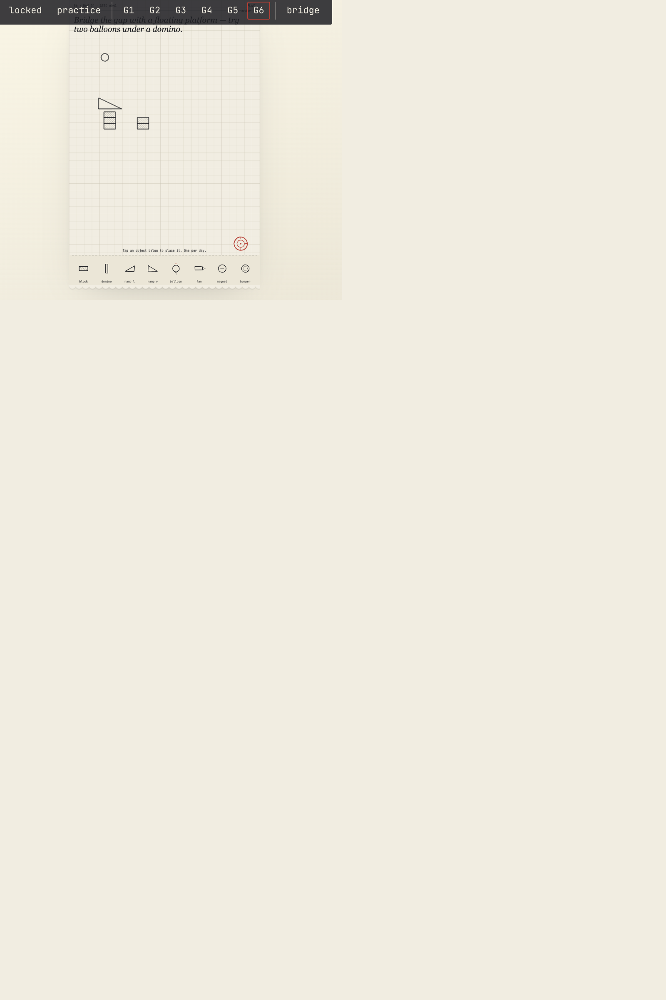
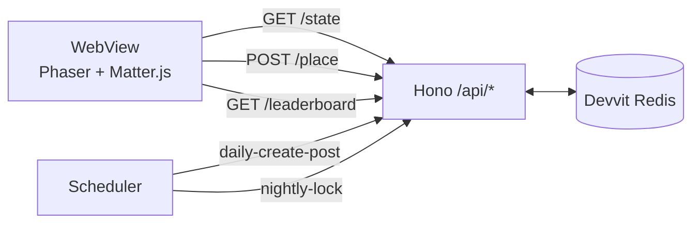

<div align="center">

# Chain Reaction

A daily co-op physics puzzle on Reddit. One piece per player. One solve per day.

[](https://developers.reddit.com)
[](https://phaser.io)
[](https://brm.io/matter-js/)
[](https://www.typescriptlang.org/)
[](https://hono.dev)
[](https://vitejs.dev)
[](https://nodejs.org)
[](#license)

[Play](https://www.reddit.com/r/ChainReaction/) · [Design](docs/design.md) · [Preview](preview/README.md) · [Harness](harness/README.md)

</div>

---

## Overview

Each day, every subreddit running Chain Reaction gets a fresh puzzle: a starting setup, a target, and an empty stage in between. Every Reddit user can place exactly one piece — a domino, balloon, ramp, magnet, or bumper.

When the post locks, a deterministic physics simulation plays back the contraption everyone built together. If the goal is reached, the post is solved, and the player whose placement actually changed the outcome is named MVP in the replay.

<table>
<tr>
<td align="center" width="33%"><a href="devvit-store/screenshots/g1.png"></a><br/><sub>G1 · Drop the ball</sub></td>
<td align="center" width="33%"><a href="devvit-store/screenshots/midgame.png"></a><br/><sub>Mid-game · six contributors</sub></td>
<td align="center" width="33%"><a href="devvit-store/screenshots/g6.png"></a><br/><sub>G6 · Floating bridge</sub></td>
</tr>
</table>

## Quick start

```sh
npm install
npm run check             # type-check + determinism harness
npm run preview           # local mock — http://127.0.0.1:5173
npm run dev r/ChainReaction  # live playtest on Reddit
```

Deploy:

```sh
npm run deploy
npx devvit install r/ChainReaction
```

## How it works



A daily cycle: post created at 14:00 UTC, placement window stays open ~24h, post locks at 07:55 UTC the next day. At lock time the server runs the baseline sim, then leave-one-out re-simulates to identify the MVP, and credits the cross-post leaderboards.

The one-piece-per-user rule is enforced server-side with an atomic `SET NX` claim per `(postId, userId)`. Lock is invoked only by the scheduler — it has no HTTP route.

## Determinism

Every social moment depends on `runSim(seed, placements, template)` returning byte-identical output for identical inputs. The standalone harness in [harness/](harness/README.md) verifies this on every architecture change. `Math.random()`, wall-clock time, and unordered iteration are not allowed inside the sim.

```sh
npm run harness
```

## Layout

```
docs/         design doc, constants, sim contract
src/shared/   constants, types, catalog, goals, sim, rng — used by client and server
src/server/   Hono routes, Redis state, post lifecycle, cron
src/client/   Phaser scenes (Play / Replay / Practice), design tokens
preview/      Vite + mock-API harness for headless local dev
harness/      standalone determinism test (no Devvit, no build step)
devvit-store/ App Directory submission packet + screenshots
devvit.json   menus, triggers, cron, permissions
```

## Scripts

| Script | |
|---|---|
| `npm run check` | Type-check and run the determinism harness. Pre-commit gate. |
| `npm run dev [r/sub]` | Live-reload playtest on a Reddit subreddit. |
| `npm run preview` | Local Vite preview with mocked `/api/*`. |
| `npm run harness` | Determinism harness only. |
| `npm run deploy` | Type-check and upload to Devvit. |
| `npm run launch` | Deploy and publish to the App Directory. |

## License

BSD-3-Clause. See [package.json](package.json#L5).
