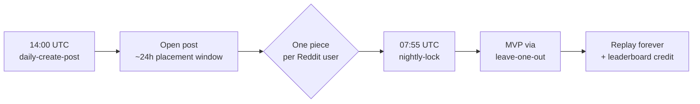

# Chain Reaction — App Directory submission

Submission packet for the Reddit Devvit App Directory.

[← Repo README](../README.md) · [Design](../docs/design.md)

---

## How a day plays out

---

## Tagline (56 chars)

> Reddit's daily co-op physics puzzle. One piece per player.

---

## Short description (190 chars)

> A daily co-op physics puzzle. Each player drops one piece — a domino, balloon, ramp — onto a shared post. When it locks, the sim replays for everyone and the MVP is haloed.

---

## Long description

Each subreddit gets a fresh puzzle every day: a starting setup, a goal, and an empty stage in between. The catch — every Reddit user can place **exactly one piece**. A domino, a ramp, a balloon, a magnet, a bumper. That's it.

When the post locks, a deterministic 2D physics simulation plays back the contraption everyone built together. If the goal is reached, the post is solved and a single MVP is highlighted — the one player whose placement actually changed the outcome.

The replay is the social moment: commenters scrub it, share it, argue about whose placement was load-bearing. Determinism means the leaderboard is honest and the MVP is real.

For mods, it's zero configuration. Install the app, schedule the daily cron, and posts appear with titles like *"Chain Reaction · Day 12: Get the ball to the bottom-right corner."* The lock is automatic.

---

## Features

- One placement per Reddit user, per post
- 6 hand-crafted puzzle templates on a rotating daily schedule (G1–G6)
- 8 piece types: block, domino, ramp L/R, ball, balloon, fan, magnet, bumper
- Deterministic physics with shared replay
- Automatic MVP detection via leave-one-out analysis
- Cross-post leaderboard (Devvit Redis sorted set)
- Practice sandbox so first-timers don't burn their daily placement
- Honors `prefers-reduced-motion`
- Mobile-first portrait (2:3); desktop newspaper frame ≥ 1100 px
- Zero external services — all state in Devvit Redis

---

## Categories

Games · Puzzle · Daily content · Community / co-op

---

## Screenshots

| File | Caption |
|---|---|
| `screenshots/g1.png` | G1 — Get the ball to the bottom-right corner. |
| `screenshots/g2.png` | G2 — Tip a domino past 60°. |
| `screenshots/g6.png` | G6 — Build a floating bridge with two balloons + a domino. |
| `screenshots/midgame.png` | Mid-game stage with six players' contributions. |
| `screenshots/practice.png` | Practice sandbox — unlimited placements. |

Screenshots include the dev preview's mode-switch strip (~35 px top); recrop to canvas-only before submission.

---

## Submission checklist

- [ ] Hero image 1200×630 (needs creation)
- [x] App icon at `assets/icon.png` (verify 256×256+)
- [x] Screenshots: 5 supplied (recrop)
- [ ] Submit short description
- [ ] Submit long description
- [ ] Category: Games › Puzzle
- [ ] Demo URL: <https://www.reddit.com/r/chainreaction_test/>
