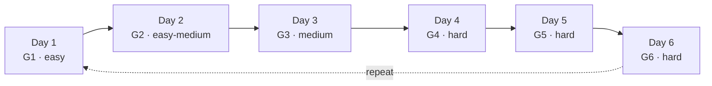
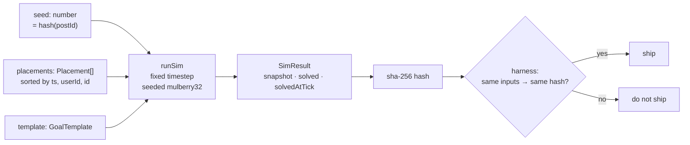
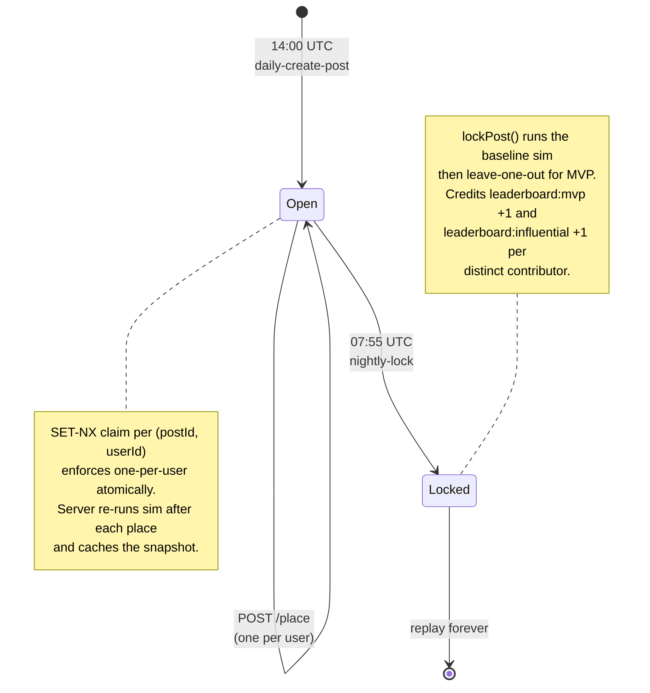

# Chain Reaction — Design Doc

Source of truth for physics constants, the object catalog, and the goal templates. Hand-tuned so the determinism harness, the server sim, and the Phaser client all agree.

[← README](../README.md)

---

## World constants

These are the only physics knobs. Anything not listed uses Matter.js defaults.

| Constant | Value | Notes |
|---|---|---|
| `WORLD_W` | 800 px | Logical width. Client scales to viewport. |
| `WORLD_H` | 1200 px | Portrait. Mobile-first. |
| `GRAVITY_Y` | 1.0 | Matter default; well-tuned. |
| `TIMESTEP_MS` | 16.6667 | Fixed. Never use variable dt. |
| `MAX_TICKS_PER_PLACEMENT` | 600 | 10s sim window after each placement. |
| `SETTLE_VELOCITY_EPS` | 0.05 | px/tick, both linear and angular. |
| `SETTLE_TICKS` | 60 | Bodies must be quiet this long to "settle". |
| `MAX_PLACEMENTS_PER_POST` | 200 | Hard cap. Locks the post when reached. |
| `PLAYAREA_PAD` | 32 px | Walls inset; no placement allowed in padding. |
| `RNG_ALGO` | mulberry32 | Seeded from `hash(postId)`. No `Math.random` anywhere. |

**Determinism rules (non-negotiable):**

1. Fixed timestep, no interpolation in the sim.
2. Bodies inserted in placement timestamp order, ties broken by `userId` lex order.
3. All "random" jitter must pull from the seeded RNG.
4. No floating-point comparisons against literals — round to 4 decimals before hashing.

---

## Object catalog (8 types)

Coordinates are in world px. Sprites are placeholders for v1; physics shapes are the contract.

| Key | Shape | Size | Mass | Friction | Restitution | Static? | Notes |
|---|---|---|---|---|---|---|---|
| `domino` | rect | 12 × 64 | 1.0 | 0.3 | 0.05 | no | The bread and butter. Falls cleanly into the next. |
| `ramp_l` | right-tri | 96 × 48 | — | 0.2 | 0.0 | yes | Slope down to the left. |
| `ramp_r` | right-tri | 96 × 48 | — | 0.2 | 0.0 | yes | Slope down to the right. |
| `ball` | circle | r = 16 | 1.5 | 0.05 | 0.4 | no | Rolls. Heavy enough to push dominos. |
| `balloon` | circle | r = 20 | 0.05 | 0.0 | 0.2 | no | Negative-effective-gravity via per-tick upward force = `0.0006 * mass`. Caps at terminal velocity 2 px/tick up. |
| `fan` | rect | 64 × 32 | — | — | — | yes | Emits a directional impulse cone. Range 200 px, half-angle 25°, force `0.002` per tick on bodies inside cone. Direction set at placement (4 cardinal). |
| `magnet` | circle | r = 24 | — | — | — | yes | Attracts `ball` only. Range 150 px, force `0.0008 * (1 - d/range)` toward magnet center. |
| `bumper` | circle | r = 20 | — | 0.0 | 1.4 | yes | Super-bouncy peg. |
| `goal` | rect (sensor) | 48 × 48 | — | — | — | yes | One per post. Placed by goal template, NOT by users. Win = any dynamic body's center enters the sensor. |

> The catalog is 8 placeable types + the goal sensor (which is part of the template, not the placement palette).

### Per-object placement constraints

- Users may rotate `domino`, `ramp_l`/`ramp_r` (snap 15°), `fan` (4 cardinal only). All others fixed rotation.
- No object may overlap an existing body's AABB at placement time. Server rejects with `OVERLAP`.
- No object may be placed inside `PLAYAREA_PAD`.
- No object may be placed within 24 px of the goal sensor (no cheese).

### Tuning rationale (so future-you doesn't re-tune blindly)

- Domino height/width chosen so a ball at radius 16 reliably tips one when rolling at ≥1.0 px/tick.
- Bumper restitution 1.4 means it adds energy — intentional, makes chains recoverable from near-stalls.
- Balloon mass tiny + custom upward force gives predictable lift independent of Matter's air friction.
- Magnet only attracts `ball` to keep the sim cheap (no all-pairs force eval) and the design legible.

---

## 6 launch goal templates

Each template defines: `id`, `prompt`, `goalPos`, `startObjects[]` (pre-placed, immutable), and a hint of intended difficulty.

### G1 — "Drop the ball"
- **Prompt:** Get the ball to the bottom-right corner.
- **Start objects:** 1 `ball` at `(120, 120)` resting on a `ramp_r` at `(120, 180)`.
- **Goal:** sensor at `(720, 1100)`.
- **Difficulty:** easy. Day-1 onboarding goal.

### G2 — "Wake the dominos"
- **Prompt:** Tip the first domino from across the room.
- **Start objects:** 1 `domino` at `(680, 1080)` (already standing, near the goal). 1 `ball` resting on `ramp_l` at `(120, 200)`.
- **Goal:** sensor *attached to the back of the seed domino* — wins when seed domino rotates past 60°.
- **Difficulty:** easy-medium. Forces a long chain.

### G3 — "Up and over"
- **Prompt:** Get the ball over the wall.
- **Start objects:** 1 `ball` at `(120, 1080)`. A static wall (rect 16×400) at `(400, 800)` extending up.
- **Goal:** sensor at `(680, 1080)`.
- **Difficulty:** medium. Encourages balloons + fans.

### G4 — "Magnet maze"
- **Prompt:** Route the ball through three checkpoints, then to the goal.
- **Start objects:** 1 `ball` top-left, 3 static `magnet`-styled visual checkpoints (sensors only) the ball must pass through in order. Magnets the *user* places are still real magnets.
- **Goal:** bottom-center after all 3 checkpoints triggered.
- **Difficulty:** hard. Saved for week 2 of launch.

### G5 — "Two-ball juggle"
- **Prompt:** Both balls must reach the goal within 2 seconds of each other.
- **Start objects:** 2 `ball`s at `(120, 200)` and `(680, 200)`. Goal centered.
- **Goal:** sensor at `(400, 1100)`. Win requires both balls' sensor entries to be within 120 ticks of each other.
- **Difficulty:** hard. Synchronization puzzle.

### G6 — "Floating bridge"
- **Prompt:** Build a floating bridge using two balloons and one domino, and roll the ball across.
- **Start objects:** 1 `ball` on a `ramp_r` top-left. Wide chasm in the middle, target on the far right.
- **Goal:** sensor on the right ledge. Players must place balloons under a horizontal domino so it hovers as a bridge.
- **Difficulty:** hard. Tests hover stability + buoyancy intuition.

### Rotation

v1 ships a clean 6-day cycle:

Selected at post-create time by `pickTemplate(dayOrdinal)` in [src/shared/goals.ts](../src/shared/goals.ts) where `dayOrdinal` is days since 2026-01-01 UTC.

v2 (post-launch) will switch to a procedural generator seeded by `dailySeed(dayOrdinal)`. Same template surface, randomized layouts per day.

---

## Sim contract (what the harness verifies)

Given:
- `seed: number`
- `placements: Placement[]` (sorted as above)
- `template: GoalTemplate`

A correct sim produces:
- `finalSnapshot: { id, x, y, angle, vx, vy, va }[]` rounded to 4 decimals
- `solved: boolean`
- `solvedAtTick: number | null`
- `hash: sha256(JSON.stringify(finalSnapshot) + solved + solvedAtTick)`

**Two independent runs with identical inputs must produce identical `hash`.** If they don't, the determinism harness fails and we cannot ship — the MVP detection (leave-one-out re-sim) and the client replay both depend on this property.

---

## Daily lifecycle

The lock endpoint is **deliberately not exposed over HTTP** — only the scheduler can trigger it via direct import. This prevents tampering with the MVP/leaderboard computation.

